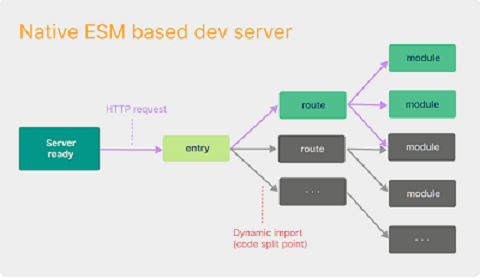

## 相对于webpack优势
项目越大，所要处理的js代码就越多，造成的结果```构建工具```需要很长时间才能启动```开发服务器```把项目跑起来   
即使使用了热更新，文件修改后也要几秒钟才能在浏览器中反映出来，迟钝会影响开发者的开发效率   
   
webpack能改吗？
```js
// webpack支持多种模块化，开始必须要统一模块化代码,
// 所以意味着他需要将所有的依赖全部读一遍
const lodash = require("lodash"); // commonjs 规范
import Vue from "vue"; // es6 module

// webpack的一个转换结果
const lodash = webpack_require("lodash");
const Vue = webpack_require("vue");
```

```vite```是基于```es modules```的, 侧重点不一样, ```webpack```更多的关注兼容性, 而```vite```关注浏览器端的开发体验   
```vite```的上手难度更低，直接启动开发服务器根据```entry```按需加载   


## create vite脚手架和vite
- ```yarn create vite```
  - 帮我们全局安装一个东西: create-vite (vite的脚手架)
  - 直接运行这个create-vite bin目录的下的一个执行配置

```create vite```内置了```vite```   
```vue-cli```内置```webpack```   
vite、create-vite ---> vue团队   

使用脚手架创建```vue-cli```/```create vite```(相当于给你一套预设)：less, babel下载并配置好了   
自己搭建：自家下载插件处理

## 初体验（开箱即用）
在默认情况下，```es module```导资源要么是相对路径，要么是绝对路径，否则浏览器不知道怎么去找   
- 那为什么es官方不默认搜寻node_modules呢？   
  - 如果浏览器可以做，可以找到下面```lodash```，那```lodash```下是也就会有更多的```import```
  - 浏览器中模块是通过```http```加载的，太多的话消耗浏览器的性能
  - ```commonjs```是运行在服务端，不一样，它找node_modules不是通过网络请求
```js
// index.html
<script src="./man.js" type="module"></script>

// man.js
import {count} from "./count.js";
console.log(count);

// 安装
yarn init -y
yarn add lodash

// count.js
import _ from 'lodash';
// 在默认情况下，es module导资源要么是相对路径
// 要么是绝对路径，否则浏览器不知道怎么去找
console.log(_);
export const count = 0;

// 安装
yarn add vite -D
// 安装vite会处理找到，路径补全
// import _ from "/node_modules/.vite/lodash";
// import __vite__cjsImport0_lodash from 
// "/node_modules/.vite/deps/lodash.js?v=55bcfa4a";
```

## 依赖预构建
vite找到对应的依赖后，然后调用```esbuild```将其他规范的代码转换成```es module```规范，
然后放到当前目录下的```node_modules/.vite/deps```对```esmodule```规范的各个模块进行统一集成

- 开发
  - yarn dev：开发环境每次重新构建vite去搜索补全路径，就是上面的```依赖预构建```
- 生产
  - 生产环境```vite```交给一个叫做```rollup```的库去完成打包，会兼容更多的场景，例如有的三方库（axios）是以```commonjs```规范导出，```module.exports```，

* vite解决的问题
  * 第三方包不同的导出格式
  * 路径的处理```node_modules/.vite/deps```
  * *** 网络多包传输的性能问题-上面举例```loadsh```下会有更多的导入问题，有了依赖预构建vite会将他们进行集成最后只生成一个或者几个模块

## vite配置文件智能提示和环境处理
[参考官网vite配置智能提示 - https://cn.vitejs.dev/config/#config-intellisense](https://cn.vitejs.dev/config/#config-intellisense)
```js
import {defineConfig} from 'vite'  // 第三方库
export default defineConfig({})
```

- 区分环境去区分配置文件
- ```vite.config.js```
  - vite.base.config.js
  - vite.prod.config.js
  - vite.dev.config.js
```js
// 正常 vite.config.js vite默认读取的配置文件
export default {
  optimizeDeps: {
    // 依赖不进行依赖预构建
    // exclude: ['lodash-es']
  }
}

import {defineConfig} from 'vite'
import viteBaseConfig from "./vite.base.config";
import viteProdConfig from "./vite.prod.config";
import viteDevConfig from "./vite.dev.config";
// 策略模式
const envResolver = {
  "build": () => Object.assign({}, viteBaseConfig, viteDevConfig),
  "serve": () => {
    console.log('开发环境');
    return Object.assign({}, viteBaseConfig, viteProdConfig)
  }
}
export default defineConfig({
  return envResolver[command]();
})
```

## vite环境变量
```vite```内置了```dotenv```这个第三方库，自动读取```.env```文件解析对应环境变量，
然后将其注入到process对象下(但是vite考虑到和其他配置的一些冲突问题, 他不会直接注入到process对象下)   

涉及到```vite.config.js```中的一些配置，```envDir```: 用来配置开发/生产环境变量的文件地址   
可以在加载配置文件前，调用```vite```的```loadEnv方法```来手动确认```env```文件，这样就可以将.env当作所有环境下的共有变量      
```js
// .env文件
APP_KEY = 110

// vite.config.js文件
export default defineConfig(({command, mode}) => {
    // console.log(process.env);  // 打印中没有APP_KEY
    console.log('process.cwd() ---> ' + process.cwd());
    // process.cwd()方法返回当前node进程的工作目录
    // 第二个参数：当前env所在目录
    const env = loadEnv(mode, process.cwd(), "");  // 第三个参数不传默认是.env
    // console.log(env);  // 打印中就有APP_KEY了

    console.log('command ---> ' + command);
    return envResolver[command]();
})
```

* mode参数   
是根据命令来的```yarn dev```相当于默认```yarn dev --mode development```，mode就是development   
也可以手动```yarn dev --mode develop```，mode就是develop
```js
const env = loadEnv(mode, process.cwd(), "");
// 调用loadEnv, 会做如下几件事
// 找到.env文件解析其中的环境变量放进一个对象
// 将传进来的mode这个变量的值进行拼接: .env.development，根据拼接名称去取对应的配置文件并环境变量, 并放进一个对象
// 最终得到的对象 const lastEnvConfig = { ...baseEnvConfig, ...modeEnvConfig }
```

* 客户端的使用   
vite会将环境变量注入到```import.meta.env```里    
注意vite做了一个拦截，避免将隐私性的变量直接注入进去   
处理是在变量前加```VITE_```，```VITE_APP_KEY = 120```   
可以通过配置-设置环境变量前缀```envPrefix: 'ENV_'```默认是```VITE_```   

## vite解析识别vue文件
```yarn create vite my-vue-app --template vue```通过脚手架创建项目   
```2、my-vue-app项目```   
运行后在网络中看App.vue响应是js代码，它是如何解析的呢？初步了解开发服务器原理node   
新建```3、vite-dev-server```中```yarn add koa```：node端的框架   
通过```koa```实例返回请求地址案例，访问的App.vue文件最终是解析成js代码

## vite中css相关
### 处理css大概原理
vite本身支持对css的处理，初体验项目里   
* vite在读取到main.js中引用到了Index.css
1. 直接去使用fs模块去读取index.css中文件内容
2. 直接创建一个style标签, 将index.css中文件内容直接copy进style标签里
3. 将style标签插入到index.html的```head```中
4. 将该css文件中的内容直接替换为js脚本(方便热更新或者css模块化), 同时设置Content-Type为js 从而让浏览器以JS脚本的形式来执行该css后缀的文件

- 模块化场景：协同开发可能起一样的类名   
mian.js中引入componentA.js和componentB.js，两套css创建同样类名会出现覆盖
1. module.css (module是一种约定, 表示需要开启css模块化)
2. 他会将你的所有类名进行一定规则的替换（将footer 替换成 _footer_i22st_1）
3. 同时创建一个映射对象{ footer: "_footer_i22st_1" }
4. 将替换过后的内容塞进style标签里然后放入到```head```标签中 (能够读到index.html的文件内容)
5. 将componentA.module.css内容进行全部抹除, 替换成JS脚本（看network）
5. 将创建的映射对象在脚本中进行默认导出

### 支持less（模块化）
安装```yarn add less```，main.js中导入less文件```index.module.less```

### vite中配置CSS
[参考地址https://cn.vitejs.dev/config/shared-options.html#css-modules](https://cn.vitejs.dev/config/shared-options.html#css-modules)   
在配置文件中的配置```vite.base.config```，```css: { modules: {} }```
- localsConvention：css生成类名key的展示形式
- scopeBehaviour：
- generateScopedName：css生成类名value的展示形式
- hashPrefix
- globalModulePaths：不参与到css模块化的路径

### vite中配置预处理器选项（less） preprocessorOptions
[参考地址-http://lesscss.cn/usage/#less-options--math](http://lesscss.cn/usage/#less-options--math)   
在配置文件中的配置```vite.base.config```，```css: { preprocessorOptions: {} }```
- math：数学模式设置   
安装了less就可以去编译less文件，就像node直接运行文件一样，```npx lessc .\index.module.less```   
- globalVars：全局变量定义，不用import形式导文件```global.less```   

### devSourcemap显示源文件
在配置文件中的配置```vite.base.config```，```css: { devSourcemap: true }```   
网页header中会显示源文件，假设程序出错，就会有索引文件

## vite中postcss
vite本身就支持postcss，配置插件去做不同的事情，设计之初想承担的维护成本是要高于less的   
- 例如考虑浏览器兼容，它可以做：   
语法降级（css变量） --- 前缀补全（--webkit） --- less编译（postcss对预处理器的插件已经停止维护，需要less自己编译，把编译结果给postcss）   

- 使用postcss（test-postcss项目）   
```yarn add postcss-cli postcss -D```，```postcss-cli```使用脚手架命令，```postcss```编译操作   
[postcss-cli命令参考地址-https://github.com/postcss/postcss-cli](https://github.com/postcss/postcss-cli)   
```npx postcss index.css -o result.css```

```postcss.config.js配置文件```   
[postcss插件参考地址-https://github.com/postcss/postcss/blob/main/docs/plugins.md](https://github.com/postcss/postcss/blob/main/docs/plugins.md)   
```yarn add postcss-preset-env -D```安装预设环境，它包含了很多必要插件，例如就可以做语法降级，自动补全等

- vite中postcss的设置（test-vite项目）
  - 两种方式都可
  - vite配置文件中```css: { postcss: { plugins: [ postcssPresetEnv(/* pluginOptions */) ```
  - 新建```postcss.config.js```配置文件

## path.resolve()题外篇
node端去读取文件或者操作文件的时候, 如果发现你用的是相对路径, 则可使用```process.cwd()```来进行对应的拼接   
```process.cwd```：获取当前的node执行目录   
commonjs规范注入的变量```__dirname```：返回的是当前文件所在的目录   
```js
const fs = require("fs");
const path = require("path"); // path本质上就是一个字符串处理模块, 它里面有非常多的路径字符串处理方法

// const result = fs.readFileSync('./variable.css');
const result = fs.readFileSync(path.resolve(__dirname, "./variable.css"));
console.log(
    result.toString(),
    process.cwd() + '\n', // node执行目录
    __dirname + '\n', // 当前文件所在目录
    path.resolve(__dirname, "./variable.css") // 拼接字符串，进行一个绝对路径的生成
);
```

## vite加载静态资源
vite对静态资源基本上是开箱即用的   
- ```svg```：不会失真，尺寸小   
缺点：没法很好的去表示层次丰富的图片信息，一般用```svg```去做图标

## alias 路径别名
vite配置文件中   
```js
resolve: {
  alias: {
    "@": path.resolve(__dirname, "./src"),
    "@assets": path.resolve(__dirname, "./src/assets")
  }
}

// 使用
import sylasPicUrl from "@assets/sylas.png";
```

### alias原理
```3、vite-dev-server```项目中，node端将请求资源返回的页面使用```alias```的地方进行字符串替换
```js
const viteConfig = require("./vite.config");
const aliasResolver = require("./aliasResolver");

if (ctx.request.url.endsWith(".js")) {
    const JSContent = await fs.promises.readFile(path.resolve(__dirname, "." + ctx.request.url)); // 在服务端一般不会这么用
    // 对使用alias的地方进行字符串替换
    const lastResult = aliasResolver(viteConfig.resolve.alias, JSContent.toString());
    ctx.response.body = lastResult;
    ctx.response.set("Content-Type", "text/javascript");
}
```

## vite在生产环境对静态资源的处理
- 打包后的静态资源为什么要有hash
  - 刷新页面-看请求的名字是不是同一个，读取缓存
  - hash算法: 将一串字符串经过运算得到一个新的乱码字符串

- 控制输出文件名```build: { rollupOptions: { output: { assetFileNames: "[hash].[name].[ext]" }}}```   
[rollup-output配置项参考地址](https://rollupjs.org/javascript-api/#outputoptions-object)

## vite插件
就像在```postcss```中讲到，```less```和```postcss```对```css```做的不同处理   
vite会在```生命周期```的不同阶段中去调用不同的插件以达到不同的目的（生命周期：vite从开始执行到执行结束的过程）   
与webpack类似

### vite-aliases插件
自动生成别名，安装```yarn add vite-aliases -D```   
[vite官网-->插件-->社区插件-->搜vite-aliases](https://cn.vitejs.dev/plugins/#community-plugins)   
参考用法：```yarn add vite-aliases -D```   
可能会遇到node版本问题，可以使用```nvm```方便切换node版本，[nvm使用参考](https://blog.csdn.net/m0_65634497/article/details/127789013)   
- 使用：在vite配置文件```vite.base.config```手动设置resolve注释，导入```ViteAliases```
```js
// 会根据你的项目目录自动生成
[
  {find: '@', replacement: '${your_project_path}/src'},
  {find: '@assets', replacement: '${your_project_path}/src/assets'}
]
```

### 手写vite-aliases插件
- 参考：   
[vite官网-->Guide-->Plugin API-->vite-specific-hooks-->config](https://vitejs.dev/guide/api-plugin.html#vite-specific-hooks)   
[vite官网-->指引-->插件 API-->Vite 独有钩子-->config](https://cn.vitejs.dev/guide/api-plugin.html#vite-specific-hooks)   
- 新建```'plugins/MyAliases'```
```js
module.exports = (keyName='@') => {
    return {
        // 在解析vite配置文件前调用config
        // 返回值将会与vite配置文件合并，类似Object.assign
        config(config, env) {
            const resolveAliasesObj = getTotalSrcDir(keyName);
            return {
                resolve: {
                    // alias: { '@assets': 'D:\\01、web\\learn-vite\\1、test-vite\\src\\assets' }
                    alias: resolveAliasesObj
                }
            };
        }
    }
}

// 返回指定地址下的文件夹和文件名数组
fs.readdirSync(path.resolve(__dirname, "../src"));
// 异步返回文件状态信息 isDirectory()
fs.statSync(path.resolve(__dirname, basePath + "/" + name));
```

### vite插件
- vue团队-->vite：减少开发者成本，很多东西内置调用了，开箱即用例如一些loader
- react：主动权交给开发者去维护   
[vite内部调用了很多插件参考](https://github.com/vitejs/vite/blob/main/packages/vite/src/node/plugins/index.ts)

### vite-plugin-html插件
- 动态控制html内容--->ejs语法```<%=  %>```
- 安装```yarn add vite-plugin-html -D```   
[vite官网-->插件-->社区插件-->搜vite-plugin-html](https://github.com/vbenjs/vite-plugin-html)
```js
import {createHtmlPlugin} from "vite-plugin-html"

export default defineConfig({
    plugins: [
        createHtmlPlugin({ inject: { data: { title: "主页" } } }),
    ]
});
```

### 手写vite-plugin-html插件
- 参考：   
[vite官网-->Plugin API-->Vite Special Hooks-->transformIndexHtml](https://vitejs.dev/guide/api-plugin.html#transformindexhtml)
- 新建```MyCreateHtmlPlugin.js```
```js
module.exports = (options) => {
    return {
        // 转换html的
        // transformIndexHtml(html, ctx) {
        //     // 注意html中body中使用，会报错没打印证明还没有执行到此处，
        //     // 可能会有别的插件在这之前调用，所以我们要把执行时机提前
        //     console.log(html, 1122);
        // }
        transformIndexHtml: {
            // 将我们插件的一个执行时机提前
            enforce: "pre",
            transform: (html, ctx) => {
                // html内容
                // ctx当前请求的一个执行期上下文
                return html.replace(/<%= title %>/g, options.inject.data.title);
            }
        }
    }
}
```

## vite结合ts
本身对```TS```有良好的支持（类型检查、语法提示）   
```6、vite-typescript```项目，开箱即用，但存在现象是编辑器检测错误，控制台和浏览器还正常   
- 企业中ts检查配置，ts错误输出控制台   
[vite结合ts检测](https://vite-plugin-checker.netlify.app/introduction/getting-started.html#getting-started)
```json
// yarn add vite-plugin-checker -D
// yarn add typescript -D
// tsconfig.json  配置ts检查规则
{
  "compilerOptions": {
    "skipLibCheck": true, // 跳过node_modules
    "moduleResolution": "node", // 模块解析错略
    "module": "ESNext",
  }
}
```

- 构建打包时，并不执行任何类型检查   
[构建前检查](https://cn.vitejs.dev/guide/features.html#typescript)
```json
"scripts": {
  "build": "tsc --noEmit && vite build"
},
```

- 声明提示文件，三斜线指令声明
```js
// vite-env.d.ts文件，提示环境变量为例

/// <reference types="vite/client" />
interface ImportMetaEnv {
    readonly VITE_PRO_URL: string;
}
```

## vite性能优化
- 开发时构建速度
- 页面性能
- js
- css
- 生产优化vite（rollup）/webpack：分包、压缩、treeshaking、图片资源压缩、CDN

### vite分包策略
打包js中代码会压缩，关掉要在vite配置文件```build: { minify: false }```
```js
// 安装lodash然后mian.ts使用
// ts类型声明 yarn add @types/lodash 
// 关掉打包不压缩
```
内容只要有一点变动，打包后生成文件就会生成新的hash值，例如lodash不需要更新的文件会重新请求，所以要进行单独打包处理   
[vite官网-->配置-->构建选项-->搜rollupOptions](https://rollupjs.org/configuration-options/#output-manualchunks)   
```6、vite-typescript```项目
```js
// vite配置文件
build: {
    minify: false, // 关掉打包不压缩
    rollupOptions: { // 配置rollup的一些构建策略
        output: { // 控制输出
            manualChunks: (id: string) => {
                // includes报错，ts认为你当前环境不在es6以后，"lib": ["ES2017", "DOM"]
                if (id.includes('node_modules')) {
                    return 'vendor';
                }
            }
        },
    }
},
```

### gzip压缩
有时候文件过大，需要将静态资源进行压缩减小体积   
将```test-vite```打包有如下提示，```chunk```-->块的概念   
```js
(!) Some chunks are larger than 500 kBs after minification. Consider:
- Using dynamic import() to code-split the application // 动态导入
- Use build.rollupOptions.output.manualChunks to improve chunking: https://rollupjs.org/configuration-options/#output-manualchunks // 分包
- Adjust chunk size limit for this warning via build.chunkSizeWarningLimit.

dist/assets/index-9c5b83c4.js        2,053.05 kB │ gzip: 1,526.98 kB // 用gzip压缩
```
[使用vite-plugin-compression：npm官网-->搜vite-plugin-compression](https://www.npmjs.com/package/vite-plugin-compression)   
```yarn add vite-plugin-compression -D```   
- 原理：服务端读取```index.js.gz```文件，已经压缩过了不用压缩，设置响应头```content-encoding-->gzip```(告诉浏览器是使用gzip压缩过的)   
  浏览器收到解压得到原本js文件
- 可能存在问题：存在解压时间，体积不大不要用，适得其反

### 动态引入import()
动态引入es6的新特性-->使代码分割，和三方库按需加载相类似   
- 常用：路由```component: () => import('../views/Login/Login.vue')```，只加载文件不执行
- webpack实现动态导入：```Promise```里```webpack_require.e()```状态

### vite的cdn加速
- 将三方依赖模块写成cdn形式注入，使代码体积更小   
  正常打包会将三方库进行压缩   
  ```7、vite-cdn```项目   
```js
// main.js
import _ from 'lodash'
const obj = _.cloneDeep({});
console.log(obj);
```
[使用vite-plugin-cdn-import：npm官网-->搜vite-plugin-cdn-import](https://www.npmjs.com/package/vite-plugin-cdn-import)   
[cdn地址参考：jsdelivr官网-->搜lodash](https://www.jsdelivr.com/)   
在vite配置文件中使用   
```js
plugins: [
    viteCDNPlugin({
        modules: [
            {
                name: 'lodash',
                var: '_',
                path: 'https://cdn.jsdelivr.net/npm/lodash@4.17.21/lodash.min.js'
            }
        ]
    }),
],
```
原理：```rollupOptions-->externalGlobals```

## vite中跨域
[同源策略参考](/ajax/#同源策略)   
[参考：解决跨域 vite/webpack/nginx/CORS/JSONP](/interview/vue.html#项目中解决跨域)


